# App Preview

Welcome Screen:
<p>
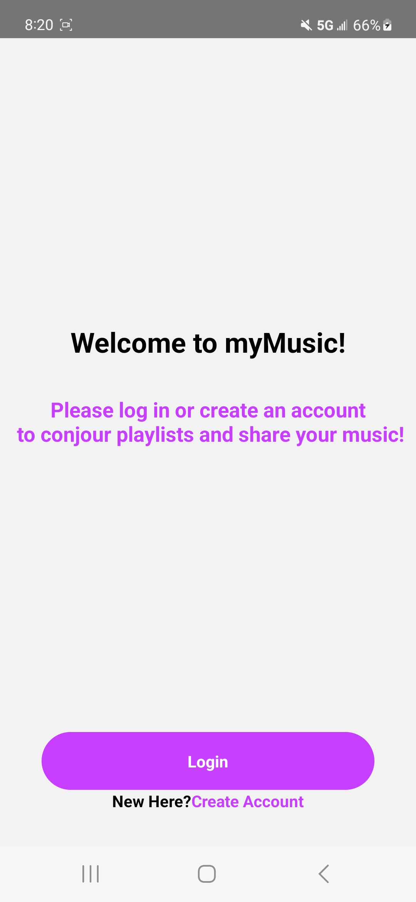
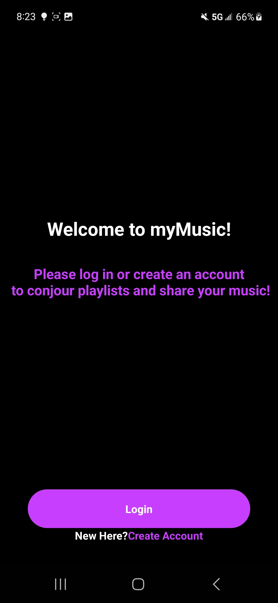
</p>

Login:
<p>
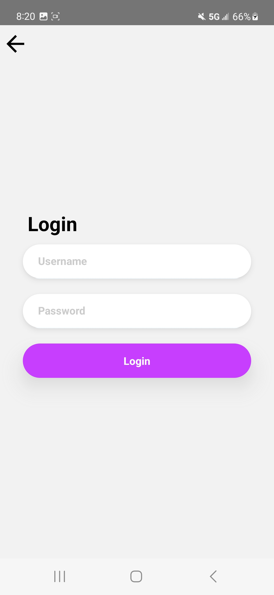
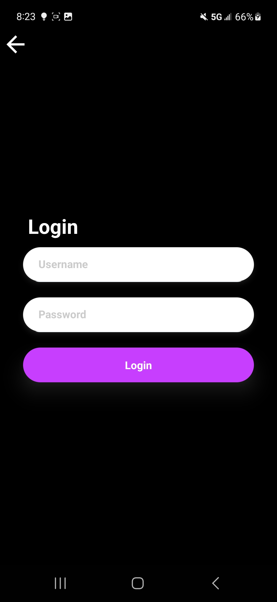
</p>

Create Account:
<p>
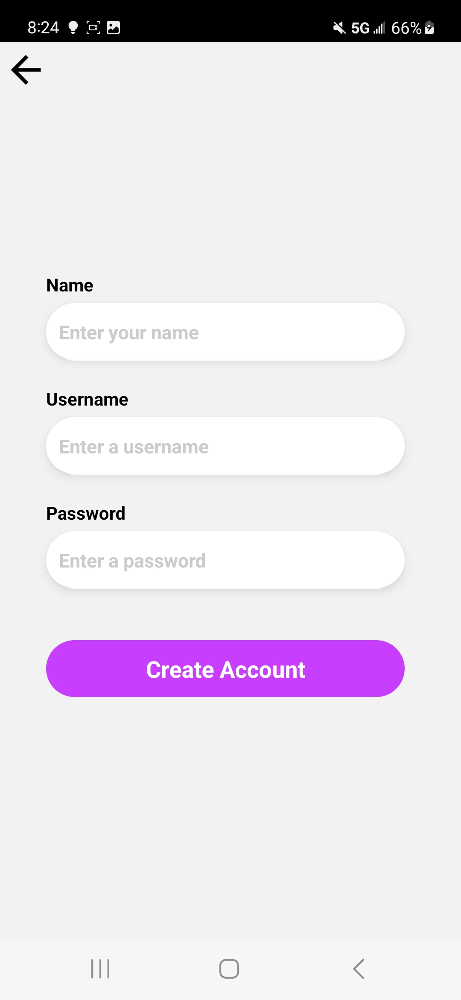
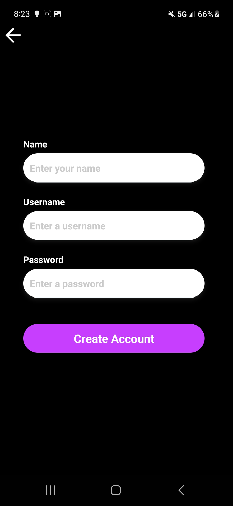
</p>

Library:
<p>
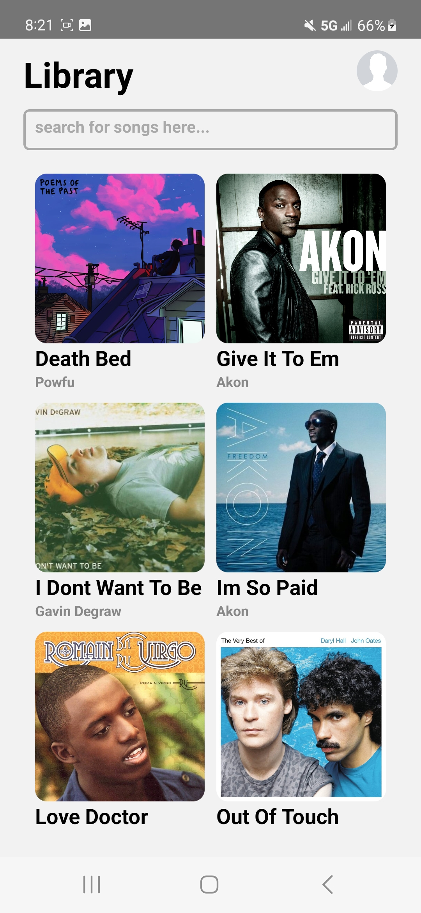
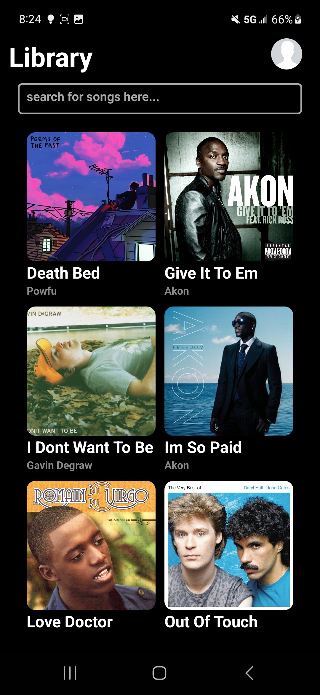
</p>

Player Modal:
<p>
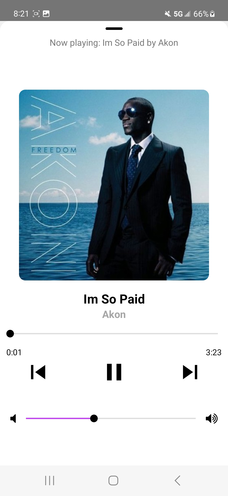
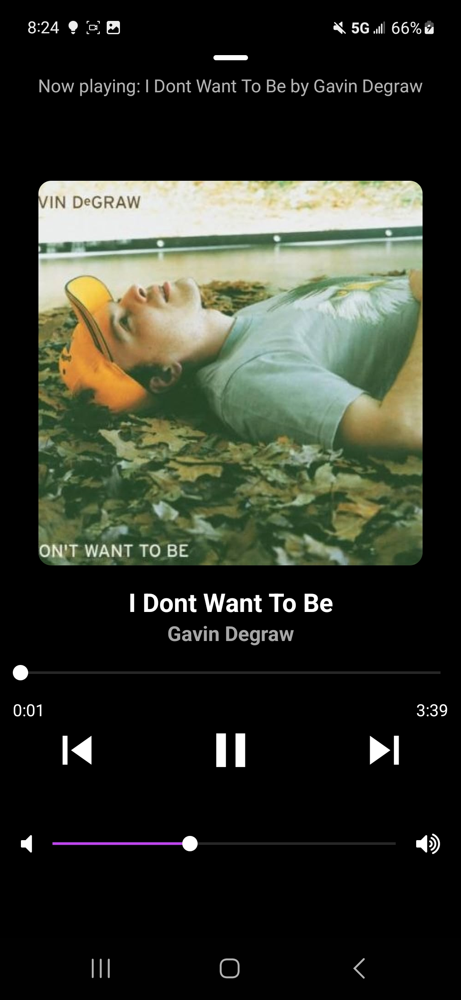
</p>

User Profile:
<p>
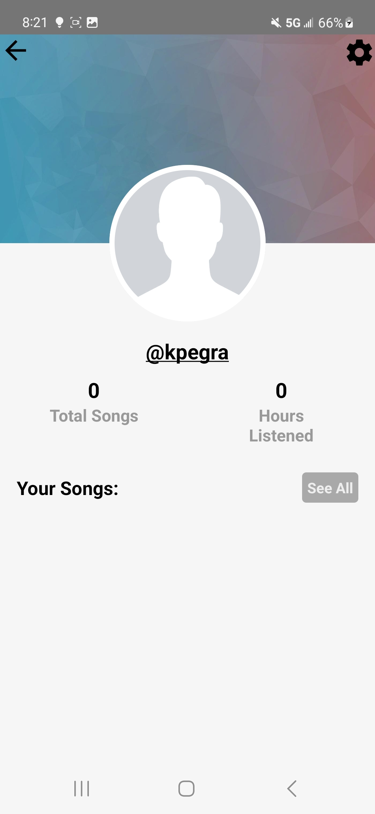
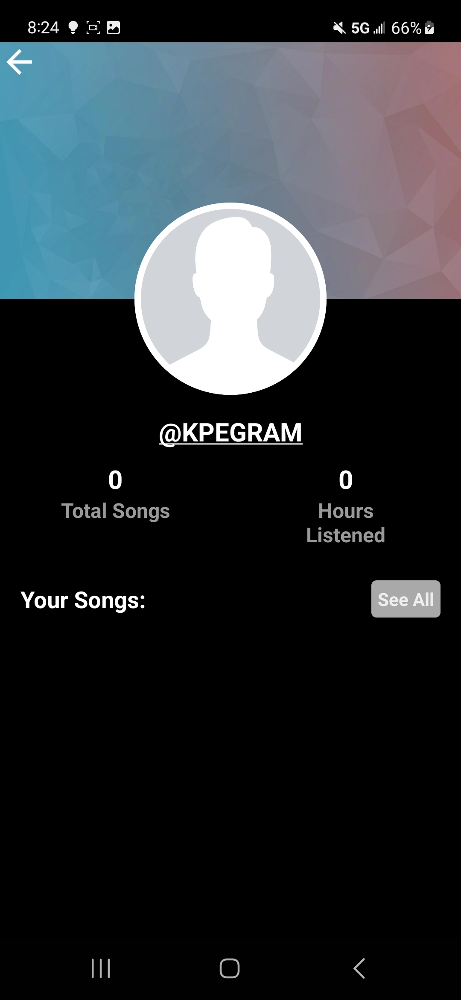
</p>

# Getting Started

**Note**: Make sure you have completed the [React Native - Environment Setup](https://reactnative.dev/docs/environment-setup) instructions till "Creating a new application" step, before proceeding.

## Step 1: Start the Metro Server

First, you will need to start **Metro**, the JavaScript _bundler_ that ships _with_ React Native.

To start Metro, run the following command from the _root_ of your React Native project:

```bash
# using npm
npm start

# OR using Yarn
yarn start
```

## Step 2: Start your Application

Let Metro Bundler run in its _own_ terminal. Open a _new_ terminal from the _root_ of your React Native project. Run the following command to start your _Android_ or _iOS_ app:

### For Android

```bash
# using npm
npm run android

# OR using Yarn
yarn android
```

### For iOS

```bash
# using npm
npm run ios

# OR using Yarn
yarn ios
```

## Libraries used

1. react-native track player to play embedded songs in project files to phone speakers
2. react-native async storage to store user info from create account/login screen and display on user profile
3. react-native slider to scrub and control music playback
4. react-native navigation to navigate between different screen throughout the app and stack different screens in order to progress thorugh the app
5. react-native vector icons to provide icons for music playback control
6. eslint and prettier to unify code for better readiblity

